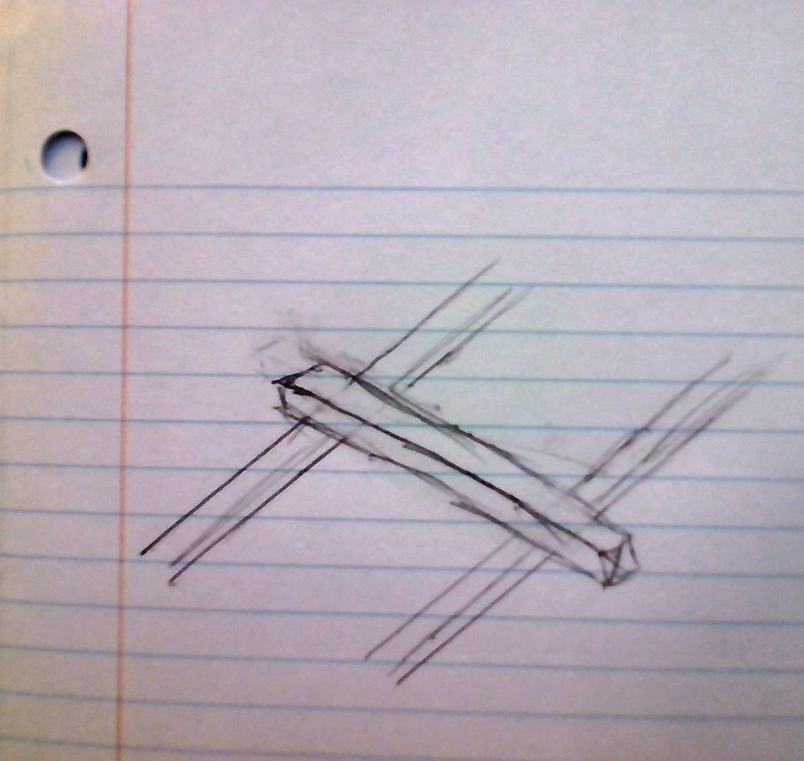

<h1>Pen Plotter Planning</h1>
<h2>Summary</h2>

We decided to make a pen plotter for our project, inspired by the letter drawer example, but graphing rectangular equations. It will function via two stepper motors controlling the movement of a pen module on the x and y axes. The pen module will move along a track, itself moving along two tracks, perpendicular to the top track. The tracks will be made of extruded aluminum linear rail and the module will move via a pulley system using GT2 timing belt. The pen will be lifted from the paper via a solenoid.

<h2>Materials</h2>
<ul>
  <li>30.5in Linear Rail/Extruded Aluminum</li>
  <li>39(?)in GT2 Timing Belt</li>
  <li>2x Stepper Motor</li>
  <li>1x Solenoid</li>
  <li>1x Ballpoint Pen</li>
  <li>1x Metro M4</li>
  <li>1x Prototyping Shield (probably)</li>
  <li>misc. standard fasteners (to be updated later)</li>
  <li>Acrylic for lasercut baseplate</li>
  <li>Filament for 3d printed track carriage</li>
</ul>
<h2>Research Needed</h2>
<ul>
  <li>[x] Movement on two axes</li>
  <li>[ ] Libraries for graphing & how to get coordinates for plotting out of them</li>
</ul>
<h2>Schedule</h2>
<table>
  <thead>
    <tr>
      <th scope="col">Week of 3/4</th>
      <th scope="col">Week of 3/11</th>
      <th scope="col">Week of 3/18</th>
      <th scope="col">Week of 3/25</th>
      <th scope="col">Week of 4/1</th>
      <th scope="col">Week of 4/8</th>
      <th scope="col">Week of 4/15</th>
      <th scope="col">Week of 4/22</th>
      <th scope="col">Week of 4/29</th>
      <th scope="col">Week of 5/6</th>
      <th scope="col">Week of 5/13</th>
      <th scope="col">Week of 5/20</th>
      <th scope="col">Week of 5/27</th>
      <th scope="col">Week of 6/3</th>
    </tr>
  </thead>
  <tbody>
    <tr>
      <td>Planning/Initial model acquisition</td>
      <td>Axes Prototype</td>
      <td>CAD for Pen Module</td>
      <td>Assemble Complete Prototype/Fix Issues</td>
      <td>Spring Break</td>
      <td>Research Code/Code</td>
      <td>Coding</td>
      <td>Finish Code?</td>
      <td>Integration/Work Out Issues</td>
      <td>Documentation</td>
      <td>Extensions/Fixing Issues</td>
      <td>Extensions/Fixing Issues</td>
      <td>Extensions/Fixing Issues</td>
      <td>Extensions/Fixing Issues</td>
    </tr>
  </tbody>
</table>
<h2>Success Criteria</h2>

We will know we are successful if the plotter can plot linear graphs with possible extension to polynomials, rational equations, etc. and/or letters and/or svgs.

<h1>Post Spring Break Update</h1>

Coming out of spring break we were running a bit behind, having not quite completed the axes prototype or pen module. We still needed to design most of the pen module, figure out a working end cap design (the initial one failed), and cut the third axis.

<h1>Final Documentation</h1>

As of the penultimate week of school, we are most of the way there, 

